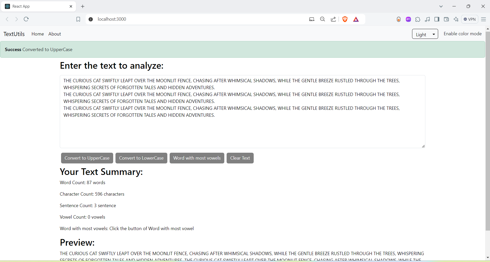
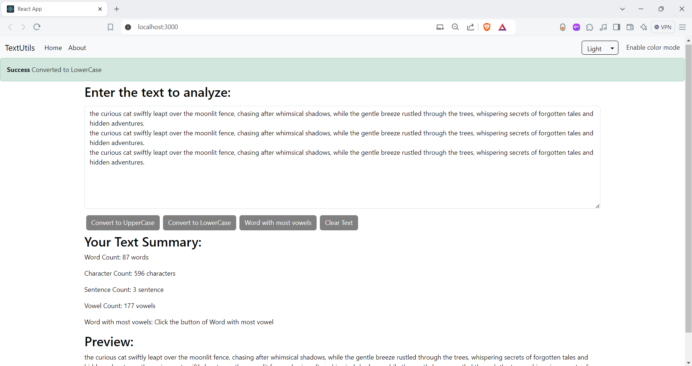

# Text Utilities Website

## Overview

The **Text Utilities Website** is a React-based application designed to provide users with various text manipulation features. It enables users to analyze and process text efficiently with a range of functionalities.

## Features

1. **Text Conversion**
   - **Uppercase Conversion:** Convert the input text to uppercase.
   - **Lowercase Conversion:** Convert the input text to lowercase.

2. **Text Analysis**
   - **Word Count:** Counts the total number of words in the input text.
   - **Character Count:** Counts the total number of characters, including spaces and punctuation.
   - **Sentence Count:** Counts the total number of sentences in the input text.
   - **Vowel Count:** Counts the number of vowels in the input text.
   - **Word with Most Vowels:** Identifies and displays the word with the highest number of vowels.

## Installation

To set up the project locally:

1. **Clone the Repository**
   ```bash
   git clone https://github.com/YashKhatpe/text-utils.git
   cd text-utils-website
   
## Screenshots







